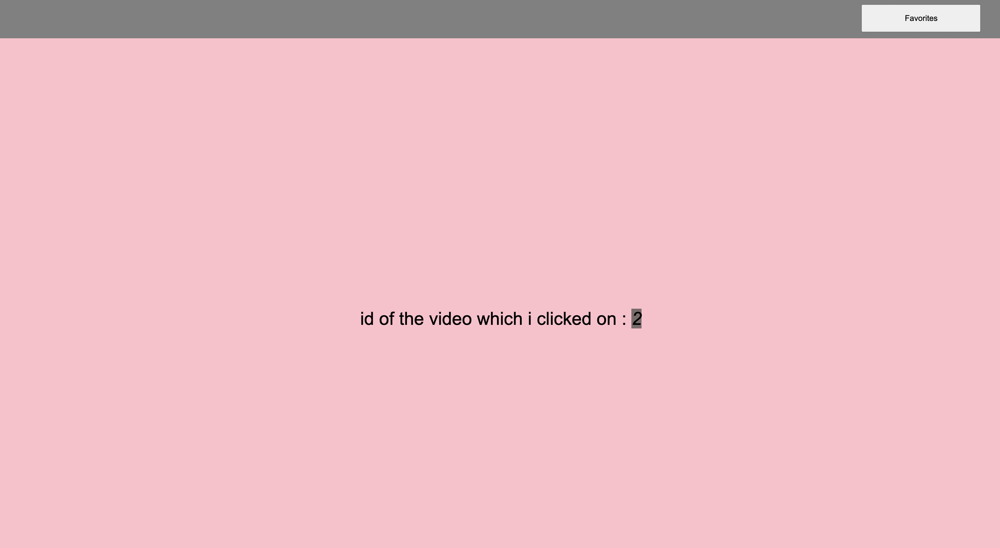

# YOUTUBE ASSİGNMENT


<br />

## **TITLES**

* [Description](#description)
* [Technologies](#technologies)
* [Setup](#setup)
* [Sources](#sources)

<br />

## Description

<br />

Below is our homepage which shows all of the videos.


<br />

Below is our favorites page which shows the videos filtered by the favorite field. 


<br />


Below is our watch page which shows the id of the video i clicked on. 



<br />

## Technologies
---
Project is created with:
* **Vue**
* **Vuex**
* **Axios**
* **JAVASCRIPT**
* **HTML5**
* **CSS3**


<br />

## Setup And Run
---
Open it in chrome via terminal;


```
$ npm install
$ npm run start
```
or 

```
$ yarn install
$ yarn start
```

<br />

## Sources
---
https://v3.vuejs.org/

https://stackoverflow.com/questions/